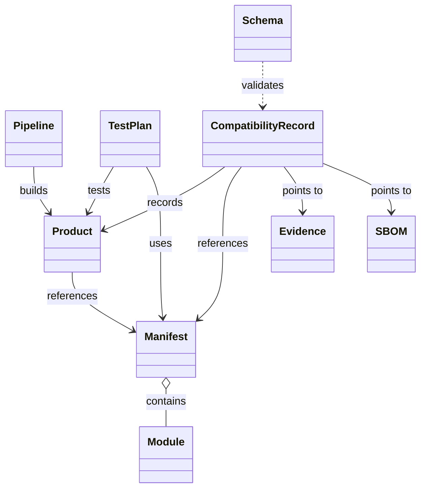
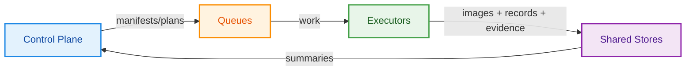

# Container as a product : The Factory (prototype)

This repository is a prototype. The ideas below are evolving; they are intended to guide experimentation and can be adapted as we learn.

A prototype factory for building Docker images from composable layers. The goal is to incrementally assemble, test, and cache reusable modules so future builds are faster and safer.

## TL;DR

- Why this exists
  - Building images across many combinations (base OS, security hardening, runtimes, app glue, multiple architectures/GPU) is slow, repetitive, and hard to audit.
  - This prototype makes builds deterministic (manifest‑driven), faster (layer/registry cache reuse), and explainable (evidence, SBOM, and compatibility records).
  - We propose a scalable architecture that can be used to build high-scale images. More in the [Additional design doc](#additional-design-docs) section.
  - Use Fragments to build up complex Docker files, and at the same time have the ability to test them individually, or partially combined, allows the Factory to experiment and accelerate the delivery of images.
  - Explore alternatives and the future state of AI-driven Factories. More in the [Bonus](#bonus-material) section.

- How it works (high‑level)
  - You pick a manifest / template ID from the control plane manifest catalog. The stitcher component renders a Dockerfile from a template + fragments, the builder uses BuildKit to cache and build, a smoke runner validates the image, and a compatibility record captures the result with pointers to evidence.
  - The control plane serves product metadata read‑only; executors (local or in pools) perform renders/builds/tests. See the diagram below and the [Architecture Principles](#architecture-principles). (Pipeline metadata is optional in this prototype.)
  - New products, unless the full stack is new, will reuse the existent fragments and cached layers to build new images with speed and consistency.

- Data structure overview
  - **Products** define what to build (manifest ID, image name, metadata)
  - (Optional) **Pipelines** define named build recipes (steps, tools, test runners) for advanced orchestration
  - **Manifests** specify the template + module versions for a build
  - **Modules** are composable Docker layers with versioned fragments
  - **Test Plans** define matrix combinations to explore (e.g., core/light versions)
  - **Compatibility Records** capture build results with evidence pointers
  - All data is stored as JSON and served via read-only APIs

- Quick start

  All code on this project runs locally. The implementation of the target architecture is not planned yet.

  - Local build + smoke test (fastest path):
    - `./tools/run-ci-local.sh [product_id]` → renders from the manifest store, builds, runs smoke tests, and writes records/evidence.
    - Defaults to `llm_factory`; pass `llm_factory_cuda` for the GPU variant.
  - End‑to‑end via API metadata:
    - `./tools/run-ci-local-api.sh [product_id]` (pipeline metadata is optional; the script falls back to defaults from the product).
  - Explore module combinations (matrix):
    - `./tools/explore-plan.sh --plan baseline_core_light [--dry-run]`.
  - Exercise a single fragment (isolation):
    - `./tools/test-fragment.sh --manifest-id core_smoke`.

- Where to look
  - Manifest IDs live under the keys in `control_plane/data/manifest.json` (e.g., `llm_factory`, `llm_factory_cuda`, `core_smoke`). Pass `--manifest-id` to tools to target one.
  - Outputs land in `control_plane/data/compatibility/{records,evidence,sbom}`; failures also emit `error-<build_id>.json` with a log excerpt.
  - On GPU hosts, install the NVIDIA Container Toolkit once: `sudo ./tools/install-nvidia-container-toolkit.sh`.
  - Why this design? See [Architecture Principles](#architecture-principles). For deeper context: [scale.md](scale.md) and [caching_layers.md](caching_layers.md).

## Setup (Python + Tools)

- Requirements
  - Python 3.10+ and pip
  - Docker (BuildKit/Buildx enabled by default in recent Docker Desktop)
  - Optional: Syft for SBOMs (`brew install syft` or see Anchore docs)

- Install Python dependencies (recommended virtualenv):
  - macOS/Linux
    - `python3 -m venv .venv && source .venv/bin/activate`
    - `pip install -r control_plane/requirements.txt`
  - Windows (PowerShell)
    - `python -m venv .venv; .\.venv\Scripts\Activate.ps1`
    - `pip install -r control_plane/requirements.txt`

## Architecture Principles

- **Container‑as‑a‑product**
  - Treat each image as a first‑class product with a clear spec: template ID/version + module versions + target platform. The spec lives in the consolidated manifest store (`control_plane/data/manifest.json`) and is addressed by `manifest_id`.
  - Products are reproducible and testable: every build emits evidence, an SBOM, and a compatibility record. Past records help decide when to rebuild vs. reuse.
  - The control plane exposes read‑only APIs so multiple teams can consume the same product definitions without coupling to the build implementation.

- **Planes (separation of concerns)**
  - Control plane: read‑only API, manifest store, plan expansion, and (in a future phase) work scheduling. It describes “what” should be built and records “what happened”.
  - Compute plane: build executors that render, build, and test on platform‑specific hosts (amd64/arm64/GPU). It executes the “how” and pushes images, evidence, and records.
  - Data plane: shared stores (OCI registry/cache, evidence/SBOM object storage, compatibility records). It preserves “what was produced”.
  - This prototype implements a minimal control plane and local executors; see Design Docs for the scale‑out plan.

- **Composable layers over monolithic Dockerfiles** – Templates + module fragments make it easy to swap stacks (e.g., CUDA vs. CPU) and keep changes localized.
  - Injection points are explicit via template markers `#--MODULE:<name>--# … #--ENDMODULE--#` and stitched by `tools/stitch.py`.
  - Module metadata (`module.json`) provides `order` so assembly is deterministic across versions.
  - Local dev loop: render one fragment with `core_smoke` or run matrix explorations with `tools/explore-plan.sh`.
  - Caching synergy: stable layers (Security/Core) hit cache even when fast‑moving layers (Light/App) change.
  - Considerations & mitigations: more files/manifests to coordinate and ordering constraints between fragments; no built‑in type checks across modules. Address by codifying simple interfaces (env args/labels/paths), linting fragments, and adding per‑module smoke tests.

- **Manifest-driven versioning** – Explicit template/module versions make rebuilds deterministic and reproducible.
  - The consolidated store (`control_plane/data/manifest.json`) keys manifests by `manifest_id` (e.g., `llm_factory`, `llm_factory_cuda`).
  - Tools accept `--manifest-id`/`--manifest-store`; test plans and records reference the ID for portability.
  - Idempotency keys naturally derive from template/module versions, base digest, and target platform.
  - Considerations & mitigations: the version matrix can grow quickly and drift if versions change ad‑hoc. Address by curating supported sets, pinning manifest entries, and using compatibility records as an allowlist/cache.

- **Configuration-first, read-only control plane** – Products/pipelines/artifacts live as JSON and are served read‑only via FastAPI for clarity and auditability.
  - JSON lives under `control_plane/data/`; the API simply reflects what’s on disk for transparency in this prototype.
  - Write paths (scheduling, promotions) can be added later with validation and a backing DB to avoid drift.
  - Records and evidence are treated as data plane concerns; the control plane links to them and summarizes rollups.
  - Considerations & mitigations: no runtime edits and potential drift between JSON and on‑disk modules; not a system‑of‑record for execution state. Address by keeping JSON in VCS, introducing write APIs with validation, or backing with a DB for multi‑user edits.

- **Evidence-backed compatibility records** – Every build/test writes a minimal verdict plus a pointer to evidence.
  - Records capture `manifest_id`, module versions, base digest, arch, test hash, result, and pointers to evidence/SBOM.
  - Failures emit `error-<build_id>.json` with a log tail to accelerate triage without opening full logs.
  - Results are idempotent and auditable; re‑runs with identical inputs can be short‑circuited.
  - Considerations & mitigations: adds some I/O and records can go stale as bases/drivers/security posture change. Address by recording base digests and test hashes and enforcing expiry/policy checks before reuse.

- **Platform-aware build scripts** – Scripts honor `--platform` so cross-arch hosts (e.g., arm64 Macs) produce usable amd64 images.
  - Smoke tests inherit platform via `DOCKER_DEFAULT_PLATFORM` to avoid runtime mismatches during `docker run`.
  - Buildx + registry cache lets pools (amd64/arm64) share intermediate layers where possible.
  - Per‑arch queues/executors (see scale.md) keep placement simple while maximizing cache hits.
  - Considerations & mitigations: cross‑building can miss runtime‑only issues and GPU validation won’t happen on non‑GPU hosts. Address by running smoke/integration tests on target architectures and executing GPU tests on GPU runners.

- **Host GPU dependency isolation** – CUDA lives in the `core` layer; hosts install the NVIDIA toolkit to expose GPUs.
  - GPU variant (`llm_factory_cuda`) swaps Core in the manifest; executors in a GPU pool pick up those jobs.
  - Keep the base image consistent (e.g., Ubuntu 22.04) to simplify layer reuse across CPU/GPU stacks.
  - Validate driver/runtime pairs on GPU hosts; gate promotion on GPU smoke tests.
  - Considerations & mitigations: bigger images and possible driver/CUDA version skew at runtime. Address by pinning CUDA versions, documenting minimum driver/toolkit, and validating on GPU hosts.

## Data Structure & Relationships

The Factory prototype uses a hierarchical data structure where each entity has specific responsibilities and relationships. All data is stored as JSON files and served via read-only APIs.

### Core Entities

- **Products** (`control_plane/data/product.json`): Define what to build with metadata like image names, tags, and manifest references
- **Pipelines** (`control_plane/data/pipeline.json`): Define build processes with steps, tools, and test runners
- **Manifests** (`control_plane/data/manifest.json`): Specify template + module version combinations for reproducible builds
- **Modules** (`control_plane/data/modules/`): Versioned Docker layer fragments with metadata and Dockerfile pieces
- **Test Plans** (`control_plane/data/test_plan.json`): Define matrix combinations to explore (e.g., core/light version matrices)
- **Schemas** (`control_plane/data/schemas/`): JSON schemas for validation (e.g., compatibility records)
- **Compatibility Records** (`control_plane/data/compatibility/records/`): Build results with evidence pointers
- **Evidence** (`control_plane/data/compatibility/evidence/`): Build logs and test outputs
- **SBOMs** (`control_plane/data/compatibility/sbom/`): Software Bill of Materials for security/compliance

### Data Structure Class Diagram



### Data Flow

1. **Configuration**: Products reference manifests; pipelines (optional) reference products
2. **Planning**: Test plans expand matrix combinations using manifest + module versions
3. **Execution**: Build processes render Dockerfiles from manifests + modules, build images, run tests
4. **Recording**: Compatibility records capture results with pointers to evidence/SBOMs
5. **Validation**: Schemas ensure data integrity across all entities

### API Endpoints

The control plane exposes read-only APIs for all entities:

- `/products` - List and retrieve products
- (optional) `/pipelines` - List and retrieve pipeline definitions  
- `/manifests` - List and retrieve manifests
- `/modules` - List modules, versions, and module details
- `/test-plans` - List and retrieve test plans
- `/schemas` - List and retrieve JSON schemas
- `/artifacts` - List and retrieve build artifacts
- `/compatibility` - Query compatibility records

## High‑Level Diagram



## Project Structure

```
factory/
├── ai4tech.md                  # AI integration capabilities and architecture
├── build/                      # Buildx bake file & cache ignore rules
├── caching_layers.md           # Docker layer caching strategy documentation
├── ci/                         # CI workflow template
├── control_plane/              # FastAPI control plane & tests
│   ├── data/                   # Centralized data store
│   │   ├── artifact.json       # Artifact definitions
│   │   ├── compatibility/      # Compatibility records, evidence, SBOMs
│   │   ├── manifest.json       # Consolidated manifest store
│   │   ├── model.json          # Model definitions
│   │   ├── modules/            # Module fragments (moved from root)
│   │   ├── pipeline.json       # Pipeline definitions
│   │   ├── product.json        # Product definitions
│   │   ├── schemas/            # JSON schemas (moved from root)
│   │   ├── task.json           # Task definitions
│   │   └── test_plan.json      # Test plan definitions
│   ├── src/                    # FastAPI application source
│   │   ├── api/                # API endpoints (products, artifacts, pipelines, etc.)
│   │   ├── entities.py         # Data models
│   │   └── main.py             # FastAPI application entry point
│   ├── tests/                  # API tests
│   └── requirements.txt        # Python dependencies
├── dockerfiles/                # Rendered Dockerfile + versioned templates
├── executive_summary.md        # Executive summary document
├── gitaction_docker_solution.md # GitHub Actions Docker solution
├── model_serve_mock/           # Mock model-serving layer packaged in the final image
├── scale.md                    # Scalability architecture documentation
├── storage/                    # Object storage for models
├── tests/                      # Integration tests
├── tools/                      # Stitching and smoke-test scripts
└── README.md                   # This file
```

### Modules / Fragments

| Fragments | Purpose                                   | Key files |
|-----------|-------------------------------------------|-----------|
| security  | OS patching & security packages           | `modules/security/<version>/`
| core      | Stable runtimes & base tooling            | `modules/core/<version>/`
| light     | Fast-moving libraries (e.g., transformers)| `modules/light/<version>/`
| model_serve_mock | Mock model-serving layer & entrypoint | `modules/model_serve_mock/<version>/`

Each module version declares metadata in `module.json` (including an `order`) and supplies a `Dockerfile.fragment`. The Stitch tool reads a manifest from the consolidated store (`control_plane/data/manifest.json`) via its ID (e.g. `llm_factory`) to select a template + fragment versions, injects those fragments into the template, and writes `dockerfiles/Dockerfile.rendered`.

Need to validate a fragment in isolation? Use the lightweight `core_smoke` template + manifest:

```
python3 tools/stitch.py --manifest-id core_smoke
docker build -f dockerfiles/Dockerfile.core_smoke -t llm-factory:core-smoke .
```

The template at `dockerfiles/templates/core_smoke/0.1.0/Dockerfile.tpl` only exposes the `#--MODULE:core--#` marker, so the rendered Dockerfile contains just the `core` fragment (`modules/core/0.3.0/`). Swap the manifest's module version to exercise other iterations, or clone the template with different markers if you want to isolate additional modules.

Prefer a single command? `./tools/test-fragment.sh` wraps the render/build/run flow (defaults target the core smoke manifest) and lets you override the manifest, output, image tag, or the runtime smoke command.

#### CUDA Variant

Need GPU runtime? Use the `llm_factory_cuda` entry in the manifest store (`control_plane/data/manifest.json`), which swaps in the CUDA-enabled core module (`modules/core/0.2.0/`) while still starting from `ubuntu:22.04`. The control-plane exposes this as product `llm_factory_cuda` (a pipeline ID may exist but is optional in this prototype).

### Compatibility Knowledge

- Schema: `control_plane/data/schemas/compatibility.schema.json`
- Records: `control_plane/data/compatibility/records/`
- Script: `tools/write-compatibility-record.py` (called by CI/local scripts to persist results)
- Evidence: `control_plane/data/compatibility/evidence/<build_id>.log` (smoke-test output captured per run)
- SBOMs: `control_plane/data/compatibility/sbom/<build_id>.json` (generated via Syft; scripts skip if Syft is absent)
- Error captures: `control_plane/data/compatibility/records/error-<build_id>.json` (written when a build fails; includes a tail of the evidence log for fast triage)

Compatibility records persist the outcome of each build/test cycle (base digest + module versions + architecture + test hash → pass/fail + image digest). When the same combination appears again, the factory can decide to reuse the recorded result instead of rebuilding from scratch.

## Typical Workflow

- Step 1 — Render the Dockerfile from a manifest
  - Reads `llm_factory` from the consolidated store and stitches the selected fragments into `dockerfiles/Dockerfile.rendered`.
  - Command:
    - `python3 tools/stitch.py --manifest-id llm_factory`

- Step 2 — Build the image (uses BuildKit cache when available)
  - Builds the rendered Dockerfile into a local image tag; add `--platform` if you need a specific arch.
  - Command:
    - `docker build -f dockerfiles/Dockerfile.rendered -t llm-factory:dev .`

- Step 3 — Smoke‑test the image
  - Starts a container, checks health, and exercises the sample endpoint; exits non‑zero on failure.
  - Command:
    - `./tools/test-runner.sh llm-factory:dev`

- Outputs and evidence
  - When using the helper scripts (`run-ci-local.sh` / API flow), evidence logs, SBOMs, and records are written under `control_plane/data/compatibility/`.

To mirror a full render→build→test cycle via a single command, run:

```
./tools/run-ci-local.sh                # defaults to product llm_factory
./tools/run-ci-local.sh llm_factory_cuda
```

To execute the same flow driven by the control‑plane API metadata (pipeline optional):

```
./tools/run-ci-local-api.sh llm_factory                 # pipeline metadata optional; falls back to product defaults
./tools/run-ci-local-api.sh llm_factory_cuda
```

If you plan to run the CUDA variant on a GPU-enabled host, install the NVIDIA Container Toolkit first:

```
sudo ./tools/install-nvidia-container-toolkit.sh
```

For multi-platform or cached builds, use Buildx Bake:

```
docker buildx bake -f build/bake.hcl
```

`buildx bake` reads `build/bake.hcl` and can target multiple platforms in one run (amd64/arm64) while reusing registry/local caches. The factory scripts stick to single-platform builds; Bake is the quickest way to fan out builds once you have BuildKit drivers and cache storage configured.

## Additional Design Docs

- Scaling plan: see [scale.md](scale.md)
- Caching strategy: see [caching_layers.md](caching_layers.md)

## Bonus material

1. Add AI to the Factory to AI to enhance the Factory's container build, test, and deployment capabilities: 
[ai4tech.md](ai4tech.md)


2. Apply the Factory’s language (manifests, fragments, stitch, cache, evidence) using GitHub Actions: 
[gitaction_docker_solution.md](gitaction_docker_solution.md)

3. Empirically check the host Docker layer limit (creates throwaway images until a build fails):
  ```
  #The --max arguments is to test the script. Once removed, the script will try to add layers until breaks
  
  ./tools/check-layer-limit.sh --max 150
  ```


