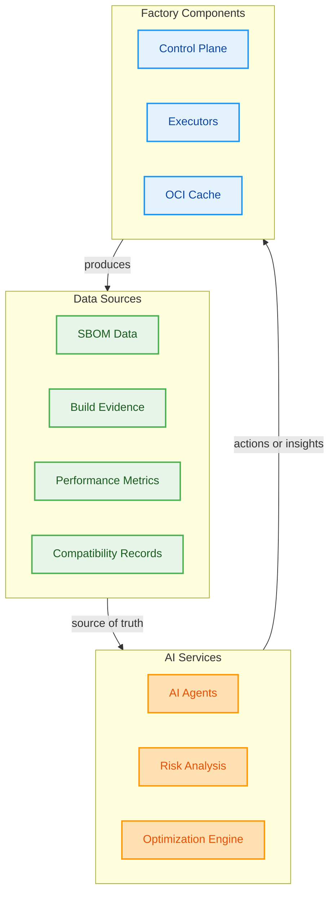

# AI-Enhanced Factory Capabilities

This repository is a prototype. The ideas below are evolving; they are intended to guide experimentation and can be adapted as we learn.

---

**Note**: This prototype was developed with AI assistance under full human supervision and control. AI was used to support the development process while maintaining human oversight and decision-making throughout.

This document describes how AI can be used to enhance the Factory's container build, test, and deployment capabilities. The Factory's modular architecture, comprehensive data collection, and scalable infrastructure provide an ideal foundation for AI-driven optimization and automation.

## AI Integration Architecture

The Factory's architecture provides rich data sources and clear integration points for AI capabilities:

## Core AI Capabilities

### 1. AI Agents for Automated Testing and Simulation

**Intelligent Test Generation:**
- **Matrix Exploration**: AI agents automatically generate test plan combinations based on module compatibility patterns
- **Failure Prediction**: Analyze historical compatibility records to predict likely failure combinations
- **Smart Test Prioritization**: Prioritize test combinations based on risk assessment and business impact

**Automated Simulation:**
- **Resource Optimization**: Simulate different executor pool configurations to optimize cost vs. performance
- **Cache Strategy Testing**: AI-driven cache warming strategies based on usage patterns
- **Multi-arch Testing**: Intelligent scheduling of cross-architecture compatibility testing

**Integration Points:**
- Leverage Factory's test plan expansion (`tools/explore-plan.sh`)
- Utilize compatibility records for training data
- Integrate with Factory's queue system for automated test scheduling

### 2. SBOM Correlations and Risk Analysis

**Vulnerability Intelligence:**
- **Real-time Risk Assessment**: Analyze SBOM data against vulnerability databases
- **Dependency Chain Analysis**: Identify transitive vulnerabilities across module layers
- **Security Trend Analysis**: Track security posture changes over time across builds

**Supply Chain Intelligence:**
- **Component Provenance**: AI-driven analysis of component sources and trust levels
- **License Compliance**: Automated license risk assessment across module combinations
- **Quality Scoring**: AI-generated quality scores for different module version combinations

**Integration with Factory Data:**
- Process SBOMs from `control_plane/data/compatibility/sbom/`
- Correlate with evidence logs for build-time security insights
- Update compatibility records with AI-generated risk scores

### 3. Pipeline Performance Analysis

**Build Optimization:**
- **Layer Efficiency Analysis**: AI analysis of Docker layer efficiency across module combinations
- **Cache Hit Optimization**: Intelligent cache warming based on build patterns
- **Resource Utilization**: AI-driven recommendations for executor resource allocation

**Performance Prediction:**
- **Build Time Estimation**: Predict build times based on module combinations and historical data
- **Resource Planning**: AI-driven capacity planning for executor pools
- **Cost Optimization**: Intelligent recommendations for ephemeral executor lifecycle management

**Integration with Factory Metrics:**
- Analyze data from Factory's observability stack
- Process executor metrics (build duration, cache hit/miss, success rate)
- Correlate with artifact metrics (image size, layer count, SBOM generation time)

### 4. Optimization Recommendations

**Intelligent Recommendations Engine:**
- **Module Version Optimization**: AI recommendations for optimal module version combinations
- **Cache Strategy Optimization**: Intelligent cache warming and retention policies
- **Resource Optimization**: AI-driven recommendations for executor pool sizing and configuration

**Cost Optimization:**
- **Ephemeral Executor Management**: AI-driven scaling decisions for cost optimization
- **Cache Efficiency**: Recommendations for cache strategy to maximize hit rates
- **Resource Right-sizing**: AI analysis of resource utilization patterns

**Performance Optimization:**
- **Build Pipeline Optimization**: AI recommendations for build process improvements
- **Test Strategy Optimization**: Intelligent test plan generation and prioritization
- **Infrastructure Optimization**: AI-driven recommendations for executor pool configuration

### 5. Resource Usage Analytics

**Intelligent Resource Management:**
- **Usage Pattern Analysis**: AI analysis of resource utilization across executor pools
- **Predictive Scaling**: AI-driven predictions for resource requirements
- **Cost Analysis**: Intelligent cost optimization recommendations

**Performance Analytics:**
- **Build Performance Trends**: AI analysis of build performance over time
- **Cache Efficiency Analysis**: Intelligent cache hit rate optimization
- **Failure Pattern Analysis**: AI-driven analysis of failure patterns and root causes

## AI-Enhanced Factory Workflows

### Intelligent Build Planning
1. **AI Analysis**: Analyze historical compatibility records and performance metrics
2. **Smart Planning**: Generate optimized test plans based on risk assessment
3. **Resource Allocation**: AI-driven executor pool sizing and configuration
4. **Execution**: Execute builds with AI-optimized parameters
5. **Learning**: Update AI models based on results and performance

### Automated Quality Assurance
1. **Risk Assessment**: AI analysis of module combinations for potential issues
2. **Test Generation**: Automated generation of comprehensive test plans
3. **Execution Monitoring**: AI-driven monitoring of build and test execution
4. **Result Analysis**: AI analysis of results with recommendations for improvements

### Intelligent Operations
1. **Predictive Maintenance**: AI-driven prediction of infrastructure issues
2. **Automated Scaling**: AI-driven scaling decisions for executor pools
3. **Cost Optimization**: Intelligent resource management for cost efficiency
4. **Performance Tuning**: AI-driven optimization of Factory operations

## Implementation Roadmap

### Phase 1: Foundation
- **Data Collection**: Enhance Factory's observability to collect AI training data
- **Basic Analytics**: Implement simple AI analysis of build patterns and performance
- **SBOM Analysis**: Basic vulnerability and risk analysis of SBOM data

### Phase 2: Intelligence
- **AI Agents**: Implement AI agents for automated testing and optimization
- **MCP Integration**: Integrate Model Context Protocol for enhanced AI capabilities
- **Advanced Analytics**: Implement sophisticated performance and cost analysis

### Phase 3: Automation
- **Autonomous Operations**: AI-driven autonomous Factory operations
- **Predictive Capabilities**: Advanced predictive analytics and recommendations
- **Self-Optimization**: AI-driven continuous optimization of Factory operations

## Data Sources for AI

The Factory provides rich data sources for AI training and analysis:

- **Compatibility Records**: Historical build results and compatibility data
- **SBOM Data**: Software Bill of Materials for security and dependency analysis
- **Evidence Logs**: Detailed build and test execution logs
- **Performance Metrics**: Executor and build performance data
- **Cache Analytics**: Cache hit rates and efficiency metrics
- **Resource Utilization**: Executor resource usage patterns

## Integration with Factory Architecture

**Control Plane Integration:**
- AI services integrate with Factory's read-only APIs
- Enhanced decision-making capabilities for work scheduling
- Intelligent invalidation policies based on AI analysis

**Executor Pool Integration:**
- AI-driven scaling decisions for ephemeral executors
- Intelligent work distribution based on AI predictions
- Automated optimization of executor configurations

**Data Plane Integration:**
- AI analysis of OCI cache efficiency
- Intelligent cache warming strategies
- AI-driven evidence and record analysis

This AI-enhanced Factory represents the next evolution of container build automation, combining the Factory's modular architecture with advanced AI capabilities for intelligent, automated, and optimized container operations.