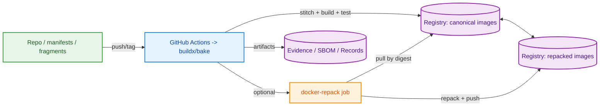

# Factory‑Friendly CI with GitHub Actions + Buildx/Bake (+ docker‑repack)

[Back to Executive Summary](executive_summary.md)

This repository is a prototype. The ideas below are evolving; they are intended to guide experimentation and can be adapted as we learn.

## 1. Purpose

Apply the Factory’s design (manifests, fragments, stitch, cache, evidence) using GitHub Actions as a pragmatic alternative to building a custom control plane and executors on day one. We focus on how these tools interlock; for how‑tos, see official links.

- Buildx/Bake: https://docs.docker.com/build/bake/
- build‑push‑action: https://github.com/docker/build-push-action
- docker‑repack: https://github.com/orf/docker-repack

---

## 2. Interlocking with Factory Principles

### Manifests, fragments, and stitch
- CI fetches or reads a `manifest_id` and runs the stitch step to render the Dockerfile (template + fragments).
- Fragments let you change Core/Light/App independently; single‑fragment templates (e.g., `core_smoke`) simplify debugging.

### Matrix expansion from plans
- Expand version combos (e.g., core/light) from test plans and feed them into a CI job matrix. The rendered Dockerfile always matches the manifest.

### Caching and evidence
- Build with `--platform` and per‑arch cache refs (e.g., `app-cache:linux-amd64`) for cross‑runner reuse.
- Capture logs and SBOM as artifacts; write a compatibility record tied to `manifest_id`.
- Optionally repack heavy images by digest (docker‑repack) to publish smaller runtime tags alongside canonical ones.

---

## 3. Combined Architecture (Factory‑friendly CI)



---

## 4. Minimal CI Flow (no how‑tos)

### Step 1: Define the Build Graph (Bake)
Use `docker-bake.hcl` to declare targets and matrices (security/core/light/app groupings; OS/arch variants). In a full Factory, these targets are derived from manifest selections; in CI we keep it source‑of‑truth for build graphs.

1) Checkout → setup buildx  
2) Stitch from `manifest_id` → render Dockerfile  
3) Build with `--platform` and registry cache (`cache-from/to`)  
4) Smoke test (runner) → capture logs  
5) SBOM + compatibility record (tie to `manifest_id`)  
6) Upload artifacts (logs/SBOM/record); push image(s)  
7) Optional: repack by digest and push optimized tag

> Note: calling Factory tools from a GitHub Actions step (inline shell)

```bash
# Assumes MANIFEST_ID, IMAGE_TAG, and optional CACHE_REF are set via env/matrix

# 1) Render from manifest
python3 tools/stitch.py --manifest-id "$MANIFEST_ID"

# 2) Build with BuildKit cache (per-arch cache ref recommended)
docker buildx build \
  --platform linux/amd64 \
  -f dockerfiles/Dockerfile.rendered \
  -t "$IMAGE_TAG" \
  ${CACHE_REF:+--cache-from=type=registry,ref=$CACHE_REF} \
  ${CACHE_REF:+--cache-to=type=registry,ref=$CACHE_REF,mode=max} \
  --load .

# 3) Smoke test
./tools/test-runner.sh "$IMAGE_TAG"

# 4) SBOM (optional) and compatibility record
if command -v syft >/dev/null 2>&1; then syft "$IMAGE_TAG" -o json > sbom.json; fi
python3 tools/write-compatibility-record.py \
  --manifest-id "$MANIFEST_ID" \
  --image "$IMAGE_TAG" \
  --status pass \
  --notes "ci-run" \
  --evidence-path evidence.log \
  --records-dir control_plane/data/compatibility/records
```

---

### Step 2: Build and Push (GitHub Actions)
Automate builds via `docker/build-push-action` (BuildKit/Buildx). Import/export registry cache for cross‑runner reuse and enable SBOM/provenance to feed evidence.

Example Workflow:
```yaml
- name: Build & Push (Bake)
  uses: docker/build-push-action@v6
  with:
    call: bake
    push: true
    cache-from: type=registry,ref=ghcr.io/org/app:cache
    cache-to: type=registry,ref=ghcr.io/org/app:cache,mode=max
    provenance: true
    sbom: true
```

---

### Step 3: Optimize with docker-repack (optional)
For large images, add a job that repacks by digest into a smaller, runtime‑friendly tag:

```yaml
- name: Repack
  run: |
    docker pull ghcr.io/org/app@${DIGEST}
    docker-repack docker://ghcr.io/org/app@${DIGEST} oci:///tmp/oci --target-size=50MB
    # Push /tmp/oci to registry as :1.2.3-repacked
```

---

## 5. Key Practices

- Publish canonical images, add repacked tags only where runtime pull time matters.
- Use registry cache (`cache-from/to`) to accelerate across runners/executors.
- Emit SBOM and provenance to power evidence/records downstream.
- Prefer matrix builds (OS/arch) to reflect target pools (amd64/arm64/GPU).
- Keep pipelines optional in this prototype; CI can fall back to product defaults.

---

## 6. Conclusion

Bake + build‑push‑action + docker‑repack give us a Factory‑friendly CI path that is:

- 🔁 **Deterministic** — a declared graph (and, in the full Factory, manifest‑driven specs)
- ⚡ **Efficient** — registry caches improve speed and lower cost across runners
- 🏗️ **Automated** — CI from source to registry, with optional repack step
- 🔎 **Observable** — SBOM/provenance feed evidence and records

Start here; when scale and placement requirements grow (dedicated amd64/arm64/GPU pools, idempotent scheduling), you can graduate to a lightweight control plane and executors while keeping manifests and caches unchanged.
