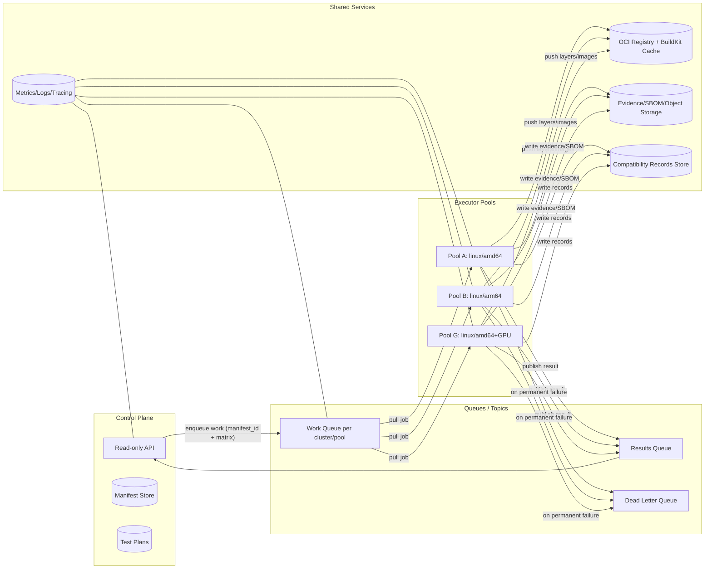
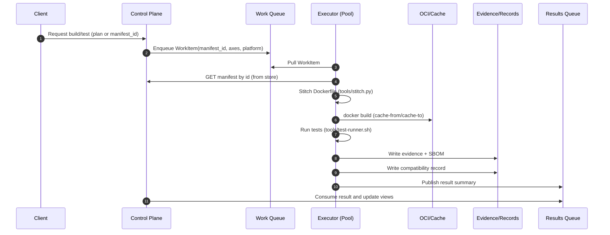

# Factory Scale-Out Plan

This repository is a prototype. The ideas below are evolving; they are intended to guide experimentation and can be adapted as we learn.

This document proposes a scalable architecture for the Factory to render, build, test, and record compatibility for many manifest combinations across heterogeneous infrastructure (multi-arch CPU, GPU), while maximizing cache reuse for base OS, Security, and Core layers.

## Goals

- Horizontal scale of build/test throughput across host pools (arch- and accelerator-specific).
- High cache hit rates for stable layers (base OS/Security/Core) across clusters.
- Deterministic inputs via the consolidated manifest store (`control_plane/data/manifest.json`).
- Robust evidence/record handling with clear failure capture and idempotent retries.
- Minimal coupling between control plane, scheduling, and executors.

## High-Level Architecture

## Work Model

Work items are derived from:

- `manifest_id` (e.g., `llm_factory`, `llm_factory_cuda`, `core_smoke`)
- Optional matrix axes (module version overrides per plan)
- Target platform(s) (e.g., `linux/amd64`, `linux/arm64`, `gpu=required`)
- Priority, deadline, and concurrency budget
- Idempotency key: hash of manifest template_id, template_version, module versions, base image digest, and target arch

Suggested work item schema (logical):

- manifest: { id, store_path }
- axes: { core, light, security, ... }
- platform: { os, arch, accelerator? }
- notes/labels: { plan_id, owner, priority }
- idempotency_key

Results schema references the existing compatibility record (augmented with `manifest_id`), plus:

- evidence_path, sbom_path (object storage URIs)
- image reference(s) built
- executor metadata (host pool, builder version)

## Scheduling and Queues

- Partition work queues per cluster/pool (e.g., `wq-amd64`, `wq-arm64`, `wq-gpu`) to keep placement simple and reduce cross-traffic.
- Use priorities for urgent security refreshes; apply backpressure per queue.
- Deduplicate by idempotency_key to avoid rebuilding already-passing combinations unless invalidated.
- Dead-letter queue (DLQ) for jobs that exceed retry policy with error summary (we already write `error-<build_id>.json`).

## Executors

- Each executor runs a loop: pull → render (stitch) → build (BuildKit) → test (runner) → sbom → record → publish.
- Platform-constrained pools (e.g., GPU) subscribe only to compatible work.
- Cache strategy:
  - Use registry-backed BuildKit cache and `--cache-from/--cache-to` to share across hosts.
  - Prewarm stable layers (base OS, Security, Core) into each pool’s cache.
  - Tag/cache keys include template/module versions from the manifest store.
- Isolation: run builds rootless when possible; sanitize secrets; prune aggressively.

## Evidence and Records

- Evidence logs and SBOMs live in shared object storage; records are written to the compatibility store (`control_plane/data/compatibility/records/` in the prototype; move to a bucket/database in production).
- Maintain immutability and retention policy; include pointers (URIs) in compatibility records.
- Continue writing `error-<build_id>.json` for failed attempts with log tail for quick triage.

## End-to-End Flow

## Invalidations and Rebuilds

- Invalidate cached results when:
  - Base image digest changes
  - Manifest entry (template/module version) changes
  - Test suite hash changes
- Keep a small policy engine in the control plane to decide when to enqueue work vs. reuse existing records.

## Observability

- Per-queue metrics: depth, throughput, age, retries.
- Executor metrics: build duration, cache hit/miss, test duration, success rate.
- Artifact metrics: image size, layer count, SBOM generation time.
- Tracing across render→build→test stages; log correlation keys include build_id.

## Security and Supply Chain

- SBOM generation (we already integrate), image signing, and provenance (SLSA-style) as follow-ups.
- Least-privilege builders; quarantine failing images; attest records with checksums.

## Rollout Plan

1. Move to consolidated manifest store (done in repo).
2. Introduce simple per-arch queues and a single executor per pool.
3. Enable remote registry cache and prewarm stable layers.
4. Add results queue and control plane consumer for asynchronous updates.
5. Scale out pools; add GPU runners; tighten invalidation policies.

## Interfaces (Prototype → Scaled)

- Work item derives from manifest store key; our current tools already accept `--manifest-id` and `--manifest-store`.
- Records include `manifest_id` and evidence pointers, aligning with the proposed results format.

