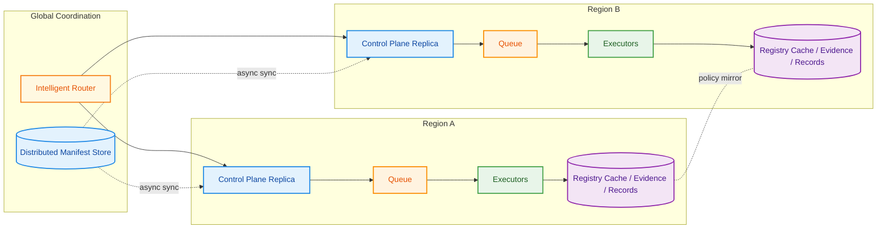

# Factory Scale-Out Plan

[Back to Executive Summary](executive_summary.md)

This repository is a prototype. The ideas below are evolving; they are intended to guide experimentation and can be adapted as we learn.

---

**Note**: This prototype was developed with AI assistance under full human supervision and control. AI was used to support the development process while maintaining human oversight and decision-making throughout.

This document proposes a scalable architecture for the Factory to render, build, test, and record compatibility for many manifest combinations across heterogeneous infrastructure (multi-arch CPU, GPU), while maximizing cache reuse for base OS, Security, and Core layers.

## Goals

- Horizontal scale of build/test throughput across host pools (arch- and accelerator-specific).
- High cache hit rates for stable layers (base OS/Security/Core) across clusters.
- Deterministic inputs via the consolidated manifest store (`control_plane/data/manifest.json`).
- Robust evidence/record handling with clear failure capture and idempotent retries.
- Minimal coupling between control plane, scheduling, and executors.

## High-Level Architecture


## Multi‑Region Deployment (reliability, sovereignty, multi‑cloud)

**Goals**

Our multi-region deployment strategy is designed to create a resilient, compliant, and vendor-agnostic Factory that can operate across different jurisdictions and cloud providers. We envision a system that gracefully handles regional outages while maintaining strict data sovereignty requirements. The architecture must avoid vendor lock-in by ensuring that only essential components are replicated across regions, while keeping sensitive data within appropriate jurisdictional boundaries.

**Approach**

The Factory's multi-region architecture begins with deploying complete control plane replicas in each region, ensuring that every region has its own read-only API, queues, and executor pools capable of handling all supported architectures. Each region maintains its own registry cache and evidence storage, with intelligent policy-driven mirroring that respects data sovereignty requirements while enabling efficient cross-region collaboration.

The manifest store operates as a distributed read-only system, with changes propagating asynchronously across regions to maintain consistency without creating tight coupling. Our routing policies intelligently assign work to the most appropriate region based on tenant preferences, data residency requirements, and current system health, with automatic failover capabilities that may temporarily operate with reduced cache efficiency but maintain full functionality.



Notes
- Evidence/records replication should follow compliance policy (some regions keep data local, others can mirror summaries)
- Cache mirroring can be selective (prewarm stable layers only) to reduce cross‑region bandwidth
- Observability dashboards should segment by region and aggregate globally

## Scheduling and Queues

- Partition work queues per cluster/pool (e.g., `wq-amd64`, `wq-arm64`, `wq-gpu`) to keep placement simple and reduce cross-traffic.
- Use priorities for urgent security refreshes; apply backpressure per queue.
- Deduplicate by idempotency_key to avoid rebuilding already-passing combinations unless invalidated.
- Dead-letter queue (DLQ) for jobs that exceed retry policy with error summary (we already write `error-<build_id>.json`).

## Executors

- Each executor runs a loop: pull → render (stitch) → build (BuildKit) → test (runner) → sbom → record → publish.
- Platform-constrained pools (e.g., GPU) subscribe only to compatible work.
- Cache strategy:
  - Use registry-backed BuildKit cache and `--cache-from/--cache-to` to share across hosts.
  - Prewarm stable layers (base OS, Security, Core) into each pool's cache.
  - Tag/cache keys include template/module versions from the manifest store.
- Isolation: run builds rootless when possible; sanitize secrets; prune aggressively.

### Ephemeral Executors for Cost Optimization

**Why Ephemeral Executors Matter:**
- **Cost Savings**: Executors can be terminated when idle, significantly reducing infrastructure costs
- **Elastic Scaling**: Executor pools can scale up/down based on demand without maintaining idle resources
- **Resource Efficiency**: Only pay for compute time actually used for builds and tests

**Critical Dependencies for Ephemeral Success:**

**1. Observability is Essential:**
- **Real-time Monitoring**: Track executor health, build progress, and queue depth
- **Failure Detection**: Quickly identify and replace failed ephemeral executors
- **Performance Metrics**: Monitor cache hit rates, build times, and resource utilization
- **Alerting**: Immediate notification when executors fail or queues back up

**2. Control Plane as State Manager:**
- **Work Distribution**: Intelligently routes work to available ephemeral executors
- **State Persistence**: Maintains work queue state independent of executor lifecycle
- **Failure Recovery**: Requeues work when ephemeral executors terminate unexpectedly
- **Idempotency**: Ensures work can be safely retried on new executors

**3. OCI/Cache as Shared Foundation:**
- **Layer Reuse**: Ephemeral executors can leverage pre-built layers from shared cache
- **Fast Startup**: New executors can quickly resume builds using cached layers
- **Cross-Executor Sharing**: Build artifacts persist beyond individual executor lifecycle
- **Registry Integration**: Centralized storage enables seamless executor replacement

**Ephemeral Executor Lifecycle:**
1. **Spin-up**: New executor joins pool, registers with control plane
2. **Work Processing**: Pulls work from queue, leverages OCI cache for fast builds
3. **Monitoring**: Observability tracks progress and health
4. **Completion**: Publishes results, updates control plane state
5. **Termination**: Executor shuts down when idle, work state preserved in control plane

## Evidence and Records

- Evidence logs and SBOMs live in shared object storage; records are written to the compatibility store (`control_plane/data/compatibility/records/` in the prototype; move to a bucket/database in production).
- Maintain immutability and retention policy; include pointers (URIs) in compatibility records.
- Continue writing `error-<build_id>.json` for failed attempts with log tail for quick triage.

## End-to-End Flow


## Work / Result Schemas (examples)

```json
{
  "work_item": {
    "manifest_id": "llm_factory",
    "fragments": {"core": "0.1.0", "light": "0.1.0"},
    "platform": {"os": "linux", "arch": "amd64"},
    "priority": "normal",
    "idempotency_key": "<sha256 of manifest/template/modules/base/arch>"
  }
}
```

```json
{
  "result": {
    "build_id": "<uuid>",
    "manifest_id": "llm_factory",
    "status": "pass",
    "image": "llm-factory:dev-<slug>",
    "evidence_path": "s3://evidence/<build_id>.log",
    "sbom_path": "s3://sbom/<build_id>.json",
    "record_path": "s3://records/<build_id>.json"
  }
}
```

## Multi-arch Quirks

- Keep per‑arch cache refs (e.g., `llm-factory-cache:linux-amd64`, `llm-factory-cache:linux-arm64`).
- Always pass `--platform` on builds; don’t mix cache refs across arches.
- GPU pools should reuse amd64 base/core caches but add GPU‑specific layers in Core variants.

## Invalidation Sources (quick scan)

What to do when something changes in the product definition? This is an initial exercise that can be incorporated in the Factory policies and pipelines.

| Source change              | Effect on cache/records                   |
|---------------------------|-------------------------------------------|
| Base image digest         | Invalidates downstream steps, re‑record   |
| Template/module version   | Re‑render, rebuild affected layers        |
| Test suite hash           | Re‑execute tests, update record           |
| Target platform (arch)    | Separate cache namespace per arch         |

## Observability (first dashboards)

- Queues: depth, oldest age, throughput, retries/DLQ
- Executors: build duration, test duration, cache hit/miss, success rate
- Artifacts: image size, layer count, SBOM generation time

## Governance (retention/GC)

- Registry caches: keep last N tags per `manifest_id` × arch; GC older refs regularly
- Evidence/SBOM: time‑based retention (e.g., 90 days) with exceptions for releases
- Records: keep indefinitely or mirror to a database with lifecycle policies

<!-- Invalidation and observability covered above in quick-scan and first dashboards sections. -->

### Critical Observability for Ephemeral Executors

**Real-time Monitoring Requirements:**
- **Executor Health**: Track active executors, their status, and resource utilization
- **Queue Depth**: Monitor work backlog to trigger executor scaling decisions
- **Cache Performance**: Track cache hit rates to ensure new executors can leverage shared layers
- **Build Progress**: Real-time visibility into build/test progress across ephemeral executors

**Failure Detection and Recovery:**
- **Executor Failures**: Detect when ephemeral executors terminate unexpectedly
- **Work Requeuing**: Automatically requeue work from failed executors
- **Resource Alerts**: Notify when executor pools need scaling or when queues back up
- **Performance Degradation**: Identify when cache misses or slow builds indicate infrastructure issues

**Cost Optimization Metrics:**
- **Idle Time Tracking**: Monitor executor idle time to optimize termination policies
- **Resource Utilization**: Track CPU/memory usage to right-size executor instances
- **Cache Efficiency**: Measure cache hit rates to ensure cost-effective layer reuse
- **Queue Processing Time**: Monitor work processing rates to optimize executor pool sizing

## Security and Supply Chain

- SBOM generation (we already integrate), image signing, and provenance (SLSA-style) as follow-ups.
- Least-privilege builders; quarantine failing images; attest records with checksums.

## Rollout Plan

- Phase 1: Consolidated manifest store (done). Outcome: deterministic inputs and simpler tooling.
- Phase 2: Per‑arch queues and a single executor per pool. Outcome: correct placement; baseline throughput.
- Phase 3: Remote registry cache + prewarming. Outcome: >70% cache hit for Security/Core; significant build speedup.
- Phase 4: Results queue + consumer. Outcome: async status; fewer blocking calls in the control plane.
- Phase 5: Scale pools (add GPU); tighten policies. Outcome: predictable latency SLOs and higher parallelism.

## See Also

- Caching approach and examples: [caching_layers.md](caching_layers.md)
- README quick start and rationale: [README.md](README.md#tldr)
- Architecture background: [README.md](README.md#architecture-principles)

## Simplified View (styled)


